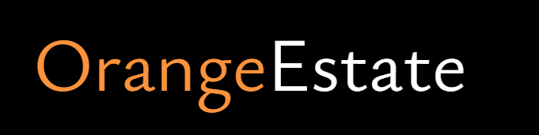

<!-- HEADER -->

  
  
  

  <a href="#about-the-project">About the project</a> &nbsp;&bull;&nbsp;
  <a href="#getting-started">Getting Started</a> &nbsp;&bull;&nbsp;
  <a href="#usage">Usage</a> &nbsp;&bull;&nbsp;
  <a href="#documentation">Documentation</a>
  

  

    Real estate website.
  

<!-- TABLE OF CONTENTS -->

  
Table of Contents

  <ol>
    <li>
      <a href="#about-the-project">About The Project</a>
      <ul>
        <li><a href="#built-with">Built With</a></li>
      </ul>
    </li>
    <li>
      <a href="#getting-started">Getting Started</a>
      <ul>
        <li><a href="#prerequisites">Prerequisites</a></li>
        <li><a href="#installation">Installation</a></li>
      </ul>
    </li>
    <li><a href="#usage">Usage</a>
      <ul>
      </ul>
    </li>
    <li><a href="#documentation">Documentation</a></li>
  </ol>

<!-- ABOUT THE PROJECT -->
## ✨ About the project

  I tried to build a basic yet modern real estate website using MERN stack and redux toolkit. What I learned and implemented over the course of this project :
    🔑 Authentication: implement JWT, Firebase, and Google OAuth for secure and seamless user access.
    🏡 CRUD Operations: Create, read, update, and delete property listings using MongoDB.
    💡 User-friendly Features: improve the user experience with image uploads, property listing management, etc...
    🚀 Advanced Search Functionality: implement search and sort features to help users find what they're looking for.

### Screencapture:

### Built with:
- 
- 
- 
 

<!-- GETTING STARTED -->
## 🛠 Getting Started
Clone down this repository.

### Prerequisites:
You will need `node` and `npm` installed globally on your machine.  

### Installation:

`npm install` 

 

<!-- USAGE -->
## 🥋 Usage

To launch the project, you'll first have to __start the server__ with this command:

`npm start`  

Then, you'll be able to __visit the app__ at:

`localhost:3000`

<!-- DOCUMENTATION -->
## 📚 Documentation
- [Tailwind documentation](https://tailwindcss.com/)
- [React.js documentation](https://beta.reactjs.org/)
